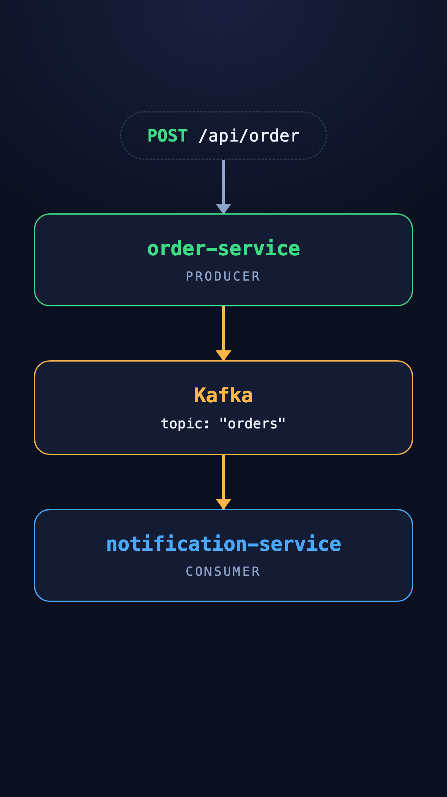

# Microservices + Kafka — in 30 lines of code

A tiny, runnable demo that shows **how two microservices talk to each other without ever calling each other**.

You place an order. A notification appears. The two services never exchange a single HTTP request — **Kafka** sits in the middle.

> 📱 This repo is the code behind an Instagram reel tutorial. Clone it, run one command, and watch the concept happen live.

---

## The idea in one picture

<p align="center">
  
</p>

```
POST /api/order
      │
      ▼
┌──────────────────┐        ┌─────────────────┐        ┌────────────────────────┐
│  order-service   │───────▶│      Kafka      │───────▶│  notification-service  │
│    PRODUCER      │  write │ topic: "orders" │   read │       CONSUMER         │
│      :3000       │        │                 │        │         :3001          │
└──────────────────┘        └─────────────────┘        └────────────────────────┘
```

**order-service** doesn't know notification-service exists. It just shouts *"an order happened!"* into a Kafka topic and replies to the user immediately.

**notification-service** is listening to that topic. Whenever a message shows up, it reacts.

That's the whole lesson.

---

## Why this matters (the microservices part)

The naive way to build this is a direct call:

```js
// ❌ order-service calling notification-service directly
await fetch("http://notification-service:3001/notify", { ... });
```

Looks harmless. But now:

| Problem | What goes wrong |
| --- | --- |
| **Tight coupling** | order-service must know the URL, the payload shape, and the uptime of notification-service. |
| **Cascading failure** | notification-service is down → the order request fails too. |
| **Slow responses** | The user waits for the notification to be sent before seeing "order placed". |
| **Hard to extend** | Want an analytics-service too? Now order-service has to call *two* services. Then three. Then five. |

With Kafka in the middle:

| Benefit | Why |
| --- | --- |
| **Decoupled** | order-service only knows the topic name `"orders"`. |
| **Resilient** | notification-service can be offline. Messages wait in the topic and get processed when it comes back. |
| **Fast** | order-service replies the instant the event is written. |
| **Extensible** | Add analytics-service, email-service, fraud-service — they all subscribe to the same topic. **Zero changes to order-service.** |

That last row is the reason event-driven architecture exists.

---

## Kafka vocabulary (only 5 words you need)

| Term | Plain English | In this repo |
| --- | --- | --- |
| **Broker** | The Kafka server that stores messages. | The `kafka` container |
| **Topic** | A named log — like a channel messages get appended to. | `"orders"` |
| **Producer** | Anyone who writes messages to a topic. | order-service |
| **Consumer** | Anyone who reads messages from a topic. | notification-service |
| **Offset** | A message's position in the log. Consumers remember where they left off. | Printed in the consumer's logs |

The key mental model: **a Kafka topic is not a queue that empties — it's a log that you read a cursor through.** Messages stay put. Ten different services can each read the same topic at their own pace, and none of them affect the others.

---

## Run it

**Requirement:** Docker.

```bash
git clone https://github.com/SidVermaS/Microservices-Kafka.git
cd Microservices-Kafka
docker compose up --build
```

That starts Kafka, creates the `orders` topic, boots both services, and launches a Kafka UI.

### 1. Place an order

```bash
curl -X POST http://localhost:3000/api/order \
  -H "Content-Type: application/json" \
  -d '{"item":"iPhone 17","amount":79999}'
```

```json
{ "status": "ORDER_PLACED", "id": "8f3c…", "item": "iPhone 17", "amount": 79999 }
```

The response comes back instantly — order-service is already done.

### 2. See the notification

```bash
curl http://localhost:3001/api/notifications
```

```json
[{ "orderId": "8f3c…", "text": "Your iPhone 17 (₹79999) is confirmed!" }]
```

notification-service produced that on its own, from the Kafka event.

### 3. Watch it in the logs

```
order-service         | 📤 order placed → iPhone 17
notification-service  | 📥 orders[0] offset 0 → Your iPhone 17 (₹79999) is confirmed!
```

### 4. Prove the decoupling (the best part 🎯)

Kill the consumer and keep ordering:

```bash
docker compose stop notification-service

curl -X POST http://localhost:3000/api/order \
  -H "Content-Type: application/json" \
  -d '{"item":"AirPods","amount":24999}'
# ✅ still returns ORDER_PLACED — order-service doesn't care
```

Now bring it back:

```bash
docker compose start notification-service
```

It picks up every message it missed, from the exact offset where it stopped. **Nothing was lost.** Try that with a direct HTTP call.

### Browse the topic visually

Open **http://localhost:8080** — the Kafka UI shows the `orders` topic, its partitions, and every raw message sitting inside it.

---

## The code

Two files. That's the whole system.

### Producer — [order-service/src/index.js](order-service/src/index.js)

```js
const producer = kafka.producer();
await producer.connect();

app.post("/api/order", async (req, res) => {
  const order = { id: crypto.randomUUID(), ...req.body };

  // 📤 drop the event on Kafka and reply instantly — no waiting
  await producer.send({
    topic: "orders",
    messages: [{ key: order.id, value: JSON.stringify(order) }],
  });

  res.json({ status: "ORDER_PLACED", ...order });
});
```

Note what's **missing**: no mention of notification-service anywhere.

### Consumer — [notification-service/src/index.js](notification-service/src/index.js)

```js
const consumer = kafka.consumer({
  kafkaJS: { groupId: "notification-service", fromBeginning: true },
});
await consumer.connect();
await consumer.subscribe({ topics: ["orders"] });

// 📥 order events arrive here — order-service never calls this service
await consumer.run({
  eachMessage: async ({ message }) => {
    const order = JSON.parse(message.value);
    sent.push({ orderId: order.id, text: `Your ${order.item} is confirmed!` });
  },
});
```

`groupId` is how Kafka remembers this consumer's offset. Restart the service and it resumes exactly where it left off.

---

## Project structure

```
.
├── docker-compose.yml          # Kafka + topic creation + both services + Kafka UI
├── order-service/
│   ├── src/index.js            # PRODUCER  → POST /api/order
│   └── Dockerfile
├── notification-service/
│   ├── src/index.js            # CONSUMER  → GET /api/notifications
│   ├── src/reset.js            # demo helper: wipes topic + store between takes
│   └── Dockerfile
└── docs/kafka-flow.png
```

## API reference

| Method | Endpoint | Service | Purpose |
| --- | --- | --- | --- |
| `POST` | `http://localhost:3000/api/order` | order-service | Place an order → publishes to `orders` |
| `GET` | `http://localhost:3001/api/notifications` | notification-service | List notifications built from consumed events |
| `DELETE` | `http://localhost:3001/api/notifications` | notification-service | Reset the demo (clears topic + store) |

---

## Running without Docker

Kafka still needs to run somewhere, so start just that:

```bash
docker compose up kafka create-topic
```

Then in two terminals:

```bash
cd order-service && npm install && npm start          # :3000
cd notification-service && npm install && npm start   # :3001
```

Both default to `localhost:9092`, or set `KAFKA_BROKER` to point elsewhere.

---

## Try this next

The real payoff is how cheap it is to extend an event-driven system. Add a third service:

```js
const consumer = kafka.consumer({ kafkaJS: { groupId: "analytics-service" } });
await consumer.subscribe({ topics: ["orders"] });
```

A **different `groupId`** means it gets its own copy of every message — running alongside notification-service, neither aware of the other. And order-service? Untouched.

---

## Tech stack

- **Node.js 24** + **Express 5**
- **Apache Kafka 4.3** in KRaft mode (no ZooKeeper)
- [`@confluentinc/kafka-javascript`](https://github.com/confluentinc/confluent-kafka-javascript) — the official Confluent client
- **kafbat/kafka-ui** for visual topic browsing

---

Built as a teaching demo. Fork it, break it, extend it. ⭐ if it made Kafka click.
